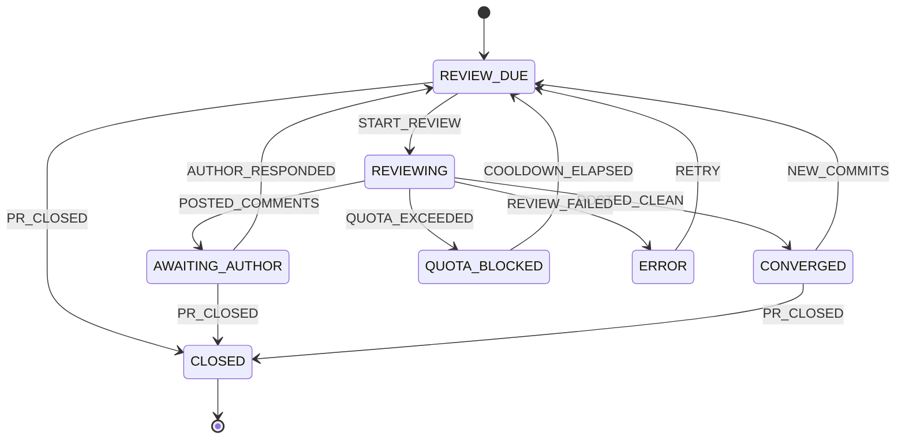

# gpt-chat-pr-reviewer

**ChatGPT의 chat 기능**으로 GitHub PR을 자동 리뷰하는 CLI. 상태 머신으로 리뷰 라운드를 관리합니다.

> Codex도, ChatGPT Work(에이전트) 기능도 아닌 **일반 대화창**을 사용합니다.
> API 토큰 대신 이미 구독 중인 ChatGPT 플랜의 대화 한도를 소비하므로 추가 비용이 들지 않습니다.

```
PR 감지 → ChatGPT 대화창에 리뷰 요청 → 응답 파싱 → 인라인 스레드로 게시
        → 작성자 응답 대기 → 반영 확인 → 재리뷰 → 수렴
```

---

## 왜 만들었나

AI PR 리뷰 도구는 이미 많지만 대부분 API 토큰을 소비합니다. 리뷰는 diff 전체를 컨텍스트에 넣기 때문에 토큰 소모가 크고, 라운드를 반복하면 비용이 빠르게 누적됩니다.

반면 ChatGPT 대화창에 PR URL을 던지고 *"리뷰해줘"* 라고 하면 GPT가 알아서 PR을 읽고 리뷰합니다. 이미 내고 있는 구독료 안에서요. 이 도구는 **그 반복 작업만 자동화**합니다.

## 동작 방식

Playwright로 시스템 Chrome을 **영속 프로필**로 띄웁니다. 최초 1회 수동 로그인하면 이후 세션이 재사용됩니다. 리뷰 요청 프롬프트를 대화창에 입력하고, 스트리밍이 끝날 때까지 대기한 뒤 응답을 수집합니다.

응답에서 JSON을 추출해 `gh` CLI로 PR에 인라인 코멘트를 게시합니다. 코멘트 위치는 diff의 실제 변경 라인과 대조해 검증하며, 인라인이 불가능한 항목은 리뷰 본문에 포함시킵니다.

## 상태 머신

리뷰 라이프사이클 전체를 명시적 상태로 관리합니다. 전이 테이블은 [`src/state/machine.ts`](src/state/machine.ts)의 `TRANSITIONS` 하나로만 정의되며, 실행·검증·시각화가 모두 여기서 파생됩니다.



| 상태 | 의미 | 벗어나는 조건 |
|---|---|---|
| `REVIEW_DUE` | 리뷰 대기 | watch가 라운드 실행 |
| `REVIEWING` | 리뷰 진행 중 | 게시 완료 / 쿼터 / 실패 |
| `AWAITING_AUTHOR` | 작성자 응답 대기 | 새 커밋 push **또는** 해당 라운드 스레드 전체 resolve |
| `CONVERGED` | 리뷰 수렴 (approve) | 새 커밋 발생 시 재개 |
| `QUOTA_BLOCKED` | ChatGPT 한도 도달 | 쿨다운 경과 (기본 3시간) |
| `ERROR` | 실패 | 자동 재시도 (기본 2회) |
| `CLOSED` | PR 닫힘/머지 | — (terminal) |

PR별 컨텍스트에 **라운드 수 · 누적 요청 코멘트 수 · 스레드별 resolve/답글 여부 · 전체 이벤트 히스토리**가 기록됩니다. `data/state/<owner>__<repo>__<n>.json`에 영속화되며, `status --json`으로 그대로 읽을 수 있어 UI를 얹기 쉽습니다.

### 리컨실리에이션

`watch` 루프는 매 사이클마다 GitHub 현황(스레드 resolve 상태, head SHA, PR 열림/닫힘)을 읽어 상태 머신 이벤트로 변환합니다. 프로세스가 죽어 `REVIEWING`에 멈춰 있어도 다음 사이클에서 자동 복구됩니다.

스캔은 **레포당 GraphQL 1회**입니다. 열린 PR 목록과 리뷰 스레드의 resolve 상태를 한 쿼리에 담아 비용이 PR 개수와 무관한 상수(1 point)가 됩니다. 기본 폴링 주기는 10초이며, 리뷰를 실행한 사이클 직후에는 대기 없이 재스캔합니다.

> 스레드 resolve는 `pullRequest.updatedAt`을 갱신하지 **않습니다**(실측 확인). 따라서 `updatedAt` 비교만으로는 resolve를 감지할 수 없고, `AWAITING_AUTHOR` 상태인 PR은 스레드 상태를 직접 조회합니다. 자세한 측정은 [#4](https://github.com/lpaiu-cs/gpt-chat-pr-reviewer/issues/4) 참고.

2차 라운드부터는 프롬프트에 **이전 라운드 코멘트 현황**(해결됨 / 답변만 있음 / 미해결)이 포함되어, 이전 지적의 반영 여부와 새 변경사항 위주로 검토합니다.

---

## 요구사항

- Node.js 20+
- [`gh` CLI](https://cli.github.com/) — 인증 완료 상태 (`gh auth login`)
- 데스크톱 Chrome
- ChatGPT 계정 — **비공개 레포를 리뷰하려면 ChatGPT 설정에서 GitHub 커넥터를 연결**하세요. 연결하면 권한 있는 private 레포도 읽습니다.

## 설치

```bash
git clone https://github.com/lpaiu-cs/gpt-chat-pr-reviewer.git
cd gpt-chat-pr-reviewer
npm install
```

## 시작하기

**1. 설정 파일 생성**

```bash
npm run dev -- init
```

`pr-review.config.json`과 `instructions.md`가 생성됩니다.

**2. ChatGPT 로그인 (최초 1회)**

```bash
npm run dev -- setup
```

브라우저가 열리면 직접 로그인하세요. 세션은 `browser-profile/`에 저장되어 이후 재사용됩니다.

**3. 리뷰 실행**

```bash
npm run dev -- review https://github.com/owner/repo/pull/123 --dry-run
```

`--dry-run`은 게시하지 않고 결과만 출력합니다. 확인 후 플래그를 빼고 실행하세요.

**4. 자동 감시**

`pr-review.config.json`의 `watchRepos`에 `owner/repo`를 추가한 뒤:

```bash
npm run dev -- watch
```

## 명령어

| 명령 | 설명 |
|---|---|
| `setup` | ChatGPT 최초 로그인 (브라우저 프로필 생성) |
| `whoami` | 현재 프로필의 ChatGPT 로그인 상태 확인 |
| `init` | 설정 파일 + 맞춤 지침 파일 생성 |
| `instructions` | 맞춤 리뷰 지침 파일 열기 |
| `review <pr>` | 리뷰 라운드 실행 — `--dry-run` `--force` `--headless` `--timeout <분>` `--from-cache` `--instructions <file>` |
| `watch` | 레포 폴링 → 동기화 → 자동 리뷰 — `--once` `--headless` `--dry-run` |
| `status [pr]` | PR 상태 조회 — `--json` |
| `graph [pr]` | 상태 머신 mermaid 다이어그램 출력 |
| `rounds <pr>` | 리뷰 라운드 이력 |

### 응답 캐시

받은 응답은 `data/responses/`에 즉시 저장됩니다. 게시 단계에서 실패했을 때 (라인 불일치, 권한 오류 등) ChatGPT 대화 한도를 다시 쓰지 않고 게시만 재시도할 수 있습니다.

```bash
npm run dev -- review <pr-url> --from-cache
```

이 경우 브라우저를 아예 띄우지 않습니다.

### 대화 세션

한 PR의 리뷰 라운드는 **같은 ChatGPT 대화**에서 이어집니다. 1차 라운드가 만든 대화 URL을 상태 파일에 기록해 두고, 다음 라운드에서 그 대화로 돌아가 이어서 질문합니다. GPT가 이전 라운드에 무엇을 왜 지적했는지 그대로 기억하므로, 반복 패턴이나 이미 합의한 판단 기준이 매 라운드 초기화되지 않습니다. `status <pr>`에서 현재 대화 URL을 볼 수 있습니다.

- 대화가 삭제됐거나 다른 계정으로 바뀌어 열 수 없으면 새 대화로 폴백하고 그 사실을 로그로 알립니다.
- `maxRoundsPerConversation`(기본 5)을 넘기면 컨텍스트 한도를 피해 새 대화로 전환하고, 프롬프트가 이전 지적을 요약해 이월합니다.
- 리뷰가 수렴(`CONVERGED`)하거나 PR이 닫히면 대화 참조를 놓습니다. 새 커밋으로 재개될 때는 새 대화에서 시작합니다.

`review`는 상태를 존중합니다. `AWAITING_AUTHOR`인 PR에 실행하면 대기 중임을 알리고 종료하며, `--force`로만 강제 실행됩니다.

## 맞춤 지침

`instructions.md`의 내용이 매 리뷰 프롬프트에 주입됩니다.

```markdown
- 코멘트 앞에 심각도를 표기: [P1] 버그·보안 / [P2] 로직·성능 / [P3] 스타일
- 스타일 지적은 최소화하고 버그·보안·성능 위주로 검토
- 테스트 누락 여부를 확인
```

`--instructions <file>`로 1회성 오버라이드도 가능합니다.

## 설정

`pr-review.config.json`:

| 키 | 기본값 | 설명 |
|---|---|---|
| `watchRepos` | `[]` | 감시할 `owner/repo` 목록 |
| `watchIntervalMs` | `10000` | 폴링 간격 (10초, 하한 5초) |
| `quotaCooldownMs` | `10800000` | 쿼터 쿨다운 (3시간) |
| `maxAutoRetries` | `2` | ERROR 자동 재시도 횟수 |
| `maxRoundsPerConversation` | `5` | 대화 1개에서 진행할 최대 라운드 수 (초과 시 새 대화) |
| `headless` | `false` | 헤드리스 실행 |
| `browserChannel` | `chrome` | Playwright 채널 |
| `selectors` | — | ChatGPT DOM 셀렉터 오버라이드 |
| `promptTemplate` | — | 프롬프트 템플릿 |

## 개발

```bash
npm run smoke   # 상태 머신 테스트
npm run build   # dist/ 생성
```

구조는 [CLAUDE.md](CLAUDE.md)를 참고하세요.

---

## 알려진 한계

- **ChatGPT UI 변경에 취약합니다.** 셀렉터가 깨지면 `pr-review.config.json`의 `selectors`에서 오버라이드하세요.
- **CAPTCHA는 자동 우회하지 않습니다.** 발생 시 직접 해결해야 합니다. 헤드리스 모드는 봇 감지에 걸릴 확률이 높습니다.
- **리뷰 품질은 GPT가 PR을 얼마나 잘 읽느냐에 달려 있습니다.** 비공개 레포는 ChatGPT에 GitHub 커넥터가 연결되어 있어야 읽을 수 있습니다.
- 라인 번호가 부정확한 경우 인라인 대신 리뷰 본문에 포함됩니다.

## 주의

이 도구는 ChatGPT 웹 인터페이스를 브라우저 자동화로 조작합니다. OpenAI 이용약관상 자동화된 접근은 회색지대이므로, 사용에 따른 책임은 사용자에게 있습니다. 계정 제재 가능성을 인지하고 사용하세요.

## 라이선스

[MIT](LICENSE)
