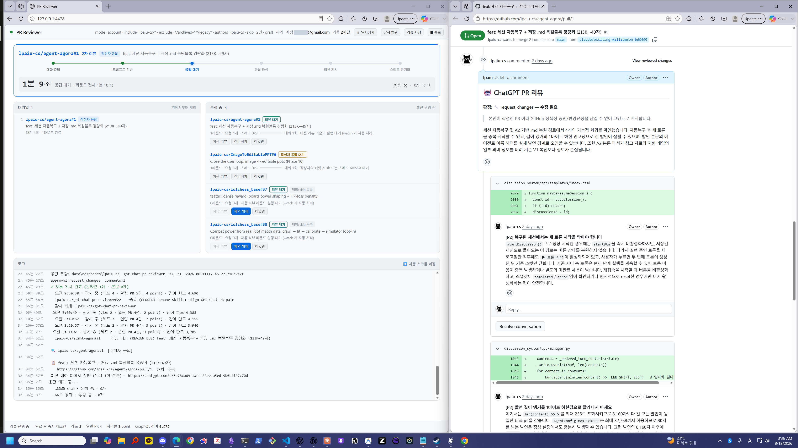

<div align="center">

# gpt-chat-pr-reviewer

**ChatGPT의 일반 대화 기능으로 GitHub PR 리뷰를 자동화하는 CLI**

> Codex나 ChatGPT Work가 아니라 브라우저의 일반 ChatGPT 대화를 사용합니다.<br>
> Codex quota 대신 이미 구독 중인 ChatGPT 플랜의 대화 한도를 사용하므로 추가 API 비용이 들지 않습니다.

```
PR 감지 → ChatGPT 리뷰 → GitHub 인라인 코멘트 → 수정 확인 → 재리뷰 → 수렴
```



<sub>자동 리뷰 진행 상황을 보여주는 로컬 대시보드</sub>

</div>

---

## 무엇을 하나요?

PR URL을 ChatGPT 대화창에 전달하고, 리뷰 응답을 파싱해 GitHub 인라인 코멘트로
게시합니다. 작성자가 새 커밋을 올리거나 리뷰 스레드를 해결하면 다시 검토하고,
더 지적할 내용이 없을 때까지 같은 흐름을 반복합니다.

- 시스템 Chrome과 로그인 세션을 재사용합니다.
- 리뷰 중에는 PR에 👀, 수렴하면 👍 반응을 남깁니다.
- 여러 PR을 감시하고 우선순위에 따라 하나씩 리뷰합니다.
- 진행 상황과 대기열을 로컬 대시보드에서 확인할 수 있습니다.
- Codex와 Claude Code용 스킬을 함께 제공합니다.

리뷰 라운드는 보통 2~15분 걸리며, 브라우저 하나를 공유하므로 직렬로 실행됩니다.

## Requirements

- Node.js 20+
- [`gh` CLI](https://cli.github.com/) 로그인 완료 상태 (`gh auth login`)
- 데스크톱 Chrome
- ChatGPT 계정

비공개 레포를 리뷰하려면 ChatGPT 설정에서 GitHub 커넥터를 연결해야 합니다.

## Install

### 에이전트에게 설치 요청하기 (권장)

아래 문장을 Codex나 Claude Code에 전달하세요.

```text
https://github.com/lpaiu-cs/gpt-chat-pr-reviewer 를 안정적인 공구 디렉터리에 설치해줘.
Node.js 20+, gh CLI, Chrome 요구사항을 확인하고 npm ci, npm run build,
npm run smoke:install을 실행한 다음, 현재 에이전트에 gpt-chat-pr-review와
gpt-chat-pr-watch 스킬을 함께 설치해줘. 기존 로컬 변경은 덮어쓰지 말고,
ChatGPT 로그인과 GitHub 감시 범위는 내 확인 없이 변경하지 마.
```

### 직접 설치하기

```bash
git clone https://github.com/lpaiu-cs/gpt-chat-pr-reviewer.git
cd gpt-chat-pr-reviewer
npm ci
npm run build
npm run smoke:install
npm run install-skills -- --target codex
```

Claude Code는 `--target claude`, 둘 다 설치하려면 `--target all`을 사용합니다.

## Quick start

### 1. ChatGPT 로그인하기

```bash
npm run dev -- setup
```

열린 Chrome에서 직접 로그인하세요. 로그인 세션은 `browser-profile/`에 저장되어
이후에도 재사용됩니다.

### 2. 대시보드 시작하기

```bash
npm run dev -- watch --ui --observe
```

브라우저에서 [http://127.0.0.1:4478](http://127.0.0.1:4478)을 여세요.
해당 포트가 사용 중이면 터미널에 실제 접속 주소가 표시됩니다.

### 3. UI에서 감시 범위 설정하기

상단의 **감시 범위** 버튼을 눌러 모드, 계정·조직 또는 레포, 제외 대상과
필터를 설정하세요. 변경 내용은 자동으로 저장되므로 JSON 파일을 직접 편집할
필요가 없습니다.

`--observe` 상태에서는 PR을 추적하고 대기열을 계산하지만 ChatGPT 리뷰는
실행하지 않습니다. 화면에서 대상이 맞는지 먼저 확인하세요.

### 4. 실제 리뷰 시작하기

```bash
npm run dev -- stop
npm run dev -- watch --ui
```

저장된 UI 설정을 그대로 사용해 자동 리뷰를 시작합니다. 이후 감시 범위,
필터, 맞춤 리뷰 지침과 종료까지 대시보드에서 관리할 수 있습니다.

PR 하나만 별도로 시험하려면 다음 명령을 사용할 수 있습니다.

```bash
npm run dev -- review https://github.com/owner/repo/pull/123 --dry-run
```

`--dry-run`은 GitHub 게시만 생략하며 ChatGPT 대화 한도는 사용합니다.

> `watch`가 실행 중일 때 다른 터미널에서 `review`를 동시에 실행하지 마세요.
> 같은 상태 파일을 다루므로 한 프로세스만 사용해야 합니다.

## 에이전트 스킬

기본 설치 명령은 다음 두 스킬을 함께 설치합니다.

| 스킬 | 하는 일 | 호출 방식 |
|---|---|---|
| `gpt-chat-pr-review` | ChatGPT 리뷰 요청부터 수렴까지 관리 | 사용자가 이름을 명시해야 함 |
| `gpt-chat-pr-watch` | 현재 상태 조회와 변화 대기 | 읽기 전용, 자동 선택 가능 |

리뷰를 요청할 때는 일반 코드 리뷰와 혼동되지 않도록 이름을 명시합니다.

```text
$gpt-chat-pr-review 스킬로 이 PR에 ChatGPT 리뷰어를 붙여줘.
```

감시 스킬은 데몬을 시작하거나 감시 범위를 넓히지 않습니다. 이미 실행 중인
데몬의 상태만 읽습니다.

## 자주 쓰는 명령

| 명령 | 설명 |
|---|---|
| `npm run dev -- review <pr-url>` | PR 한 건 리뷰 |
| `npm run dev -- watch --ui` | 자동 감시와 대시보드 시작 |
| `npm run dev -- watch --observe` | ChatGPT를 호출하지 않고 대상만 관측 |
| `npm run dev -- queue` | 리뷰 대기열 확인 |
| `npm run dev -- status [pr]` | 현재 상태 확인 |
| `npm run dev -- rounds <pr>` | 리뷰 라운드 이력 확인 |
| `npm run dev -- stop` | 현재 라운드를 마친 뒤 종료 |
| `npm run dev -- stop --now` | 즉시 종료 |

전체 옵션과 알림 자동화는 [운영 가이드](docs/operations.md)를 참고하세요.

## 안전하게 사용하기

- 감시 범위는 처음에 `--observe`로 확인하세요.
- `filters.only`를 사용하면 한 PR만 실제 리뷰하고 나머지는 관측할 수 있습니다.
- 종료할 때는 가능한 한 `stop`을 사용하세요. `stop --now`는 생성 중인 응답을 버립니다.
- 비공개 레포는 ChatGPT GitHub 커넥터가 읽을 수 있는 범위만 사용하세요.
- 이 도구는 사용자가 지정하지 않은 레포로 감시 범위를 자동 확장하지 않습니다.

## 더 자세한 문서

- [설정과 감시 범위](docs/configuration.md) — 감시 모드, 필터, 주요 설정값, 맞춤 지침
- [운영 가이드](docs/operations.md) — 캐시, 관측 모드, 대시보드, 알림, 에이전트 스킬
- [동작 원리](docs/architecture.md) — 리뷰 수명주기, 재시도, 큐, 동시 실행 제약
- [개발자 지침](AGENTS.md) — 소스 구조와 구현 계약

## 알려진 한계

- ChatGPT UI가 바뀌면 브라우저 셀렉터를 조정해야 할 수 있습니다.
- CAPTCHA는 자동 우회하지 않으며 직접 해결해야 합니다.
- 비공개 레포의 리뷰 품질과 접근 가능 여부는 ChatGPT GitHub 커넥터에 달려 있습니다.
- 리뷰는 브라우저 하나에서 직렬로 실행됩니다.
- 응답이 멈춘 채 생성 중으로 남는 [알려진 이슈 #1](https://github.com/lpaiu-cs/gpt-chat-pr-reviewer/issues/1)이 있습니다.
- Windows에서는 `gh` 실행 파일이 PATH에 직접 있어야 합니다.

## 개발

```bash
npm run build
npm test
npm run smoke
npm run smoke:install
```

## 주의

이 도구는 ChatGPT 웹 인터페이스를 브라우저 자동화로 조작합니다. 자동화된 접근에
따른 계정 위험과 서비스 정책을 검토하고 본인의 책임 아래 사용하세요.

## 라이선스

[MIT](LICENSE)
