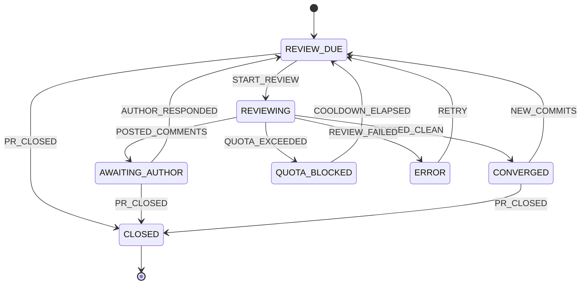

# gpt-chat-pr-reviewer

**ChatGPT의 chat 기능**으로 GitHub PR을 자동 리뷰하는 CLI. 상태 머신으로 리뷰 라운드를 관리합니다.

> Codex도, ChatGPT Work(에이전트) 기능도 아닌 **일반 대화창**을 사용합니다.
> API 토큰 대신 이미 구독 중인 ChatGPT 플랜의 대화 한도를 소비하므로 추가 비용이 들지 않습니다.

```
PR 감지 → ChatGPT 대화창에 리뷰 요청 → 응답 파싱 → 인라인 스레드로 게시
        → 작성자 응답 대기 → 반영 확인 → 재리뷰 → 수렴
```

---

## 왜 만들었나

AI PR 리뷰 도구는 이미 많지만 대부분 API 토큰을 소비합니다. 리뷰는 diff 전체를 컨텍스트에 넣기 때문에 토큰 소모가 크고, 라운드를 반복하면 비용이 빠르게 누적됩니다.

반면 ChatGPT 대화창에 PR URL을 던지고 *"리뷰해줘"* 라고 하면 GPT가 알아서 PR을 읽고 리뷰합니다. 이미 내고 있는 구독료 안에서요. 이 도구는 **그 반복 작업만 자동화**합니다.

## 동작 방식

Playwright로 시스템 Chrome을 **영속 프로필**로 띄웁니다. 최초 1회 수동 로그인하면 이후 세션이 재사용됩니다. 리뷰 요청 프롬프트를 대화창에 입력하고, 스트리밍이 끝날 때까지 대기한 뒤 응답을 수집합니다.

응답에서 JSON을 추출해 `gh` CLI로 PR에 인라인 코멘트를 게시합니다. 코멘트 위치는 diff의 실제 변경 라인과 대조해 검증하며, 인라인이 불가능한 항목은 리뷰 본문에 포함시킵니다.

## 상태 머신

리뷰 라이프사이클 전체를 명시적 상태로 관리합니다. 전이 테이블은 [`src/state/machine.ts`](src/state/machine.ts)의 `TRANSITIONS` 하나로만 정의되며, 실행·검증·시각화가 모두 여기서 파생됩니다.



| 상태 | 의미 | 벗어나는 조건 |
|---|---|---|
| `REVIEW_DUE` | 리뷰 대기 | watch가 라운드 실행 |
| `REVIEWING` | 리뷰 진행 중 | 게시 완료 / 쿼터 / 실패 |
| `AWAITING_AUTHOR` | 작성자 응답 대기 | 새 커밋 push **또는** 해당 라운드 스레드 전체 resolve |
| `CONVERGED` | 리뷰 수렴 (approve) | 새 커밋 발생 시 재개 |
| `QUOTA_BLOCKED` | ChatGPT 한도 도달 | 쿨다운 경과 (기본 3시간) |
| `ERROR` | 실패 | 자동 재시도 (기본 2회) |
| `CLOSED` | PR 닫힘/머지 | — (terminal) |

PR별 컨텍스트에 **라운드 수 · 누적 요청 코멘트 수 · 스레드별 resolve/답글 여부 · 전체 이벤트 히스토리**가 기록됩니다. `data/state/<owner>__<repo>__<n>.json`에 영속화되며, `status --json`으로 그대로 읽을 수 있어 UI를 얹기 쉽습니다.

### 리컨실리에이션

`watch` 루프는 매 사이클마다 GitHub 현황(스레드 resolve 상태, head SHA, PR 열림/닫힘)을 읽어 상태 머신 이벤트로 변환합니다. 프로세스가 죽어 `REVIEWING`에 멈춰 있어도 다음 사이클에서 자동 복구됩니다.

스캔은 **레포당 GraphQL 1회**입니다. 열린 PR 목록과 리뷰 스레드의 resolve 상태를 한 쿼리에 담아 비용이 PR 개수와 무관한 상수(1 point)가 됩니다. 기본 폴링 주기는 10초이며, 리뷰를 실행한 사이클 직후에는 대기 없이 재스캔합니다.

> 스레드 resolve는 `pullRequest.updatedAt`을 갱신하지 **않습니다**(실측 확인). 따라서 `updatedAt` 비교만으로는 resolve를 감지할 수 없고, `AWAITING_AUTHOR` 상태인 PR은 스레드 상태를 직접 조회합니다. 자세한 측정은 [#4](https://github.com/lpaiu-cs/gpt-chat-pr-reviewer/issues/4) 참고.

2차 라운드부터는 프롬프트에 **이전 라운드 코멘트 현황**(해결됨 / 답변만 있음 / 미해결)이 포함되어, 이전 지적의 반영 여부와 새 변경사항 위주로 검토합니다.

## 감시 범위

레포를 하나씩 등록하는 대신 **계정/조직 단위로 감시**할 수 있습니다. 새 레포에 PR이 열리면 설정을 고치지 않아도 자동으로 대상에 들어옵니다.

```jsonc
{
  "watch": {
    "mode": "account",              // account | repos | review-requested
    "include": ["myorg/*"],         // 글롭 허용. 슬래시가 없으면 'owner/*' 로 해석
    "exclude": ["*/archived-*"],
    "filters": {
      "authors": ["lpaiu-cs"],      // 이 작성자들의 PR만
      "labels": ["needs-review"],   // 이 라벨을 하나라도 가진 PR만
      "draft": false,               // 초안 제외 (기본값)
      "skip": ["myorg/api#12"],     // 이 PR만 콕 집어 제외
      "only": ["myorg/api#34"]      // 리뷰 대상을 이 PR로만 한정
    },
    "discoveryIntervalMs": 30000    // 레포 재탐색 주기 (기본 30초)
  }
}
```

| `mode` | 대상 |
|---|---|
| `account` | `include`의 계정/조직에서 **열린 PR이 있는 레포**를 검색으로 발견 |
| `repos` | `include`에 적은 `owner/repo`만 (글롭 불가) |
| `review-requested` | 현재 `gh` 계정에 **리뷰가 요청된 PR만** (레포 단위가 아니라 PR 단위) |

필터는 AND로 적용되며, 걸린 PR은 추적을 시작하지도 않습니다. `filters`가 없으면 **초안(draft)은 제외**됩니다 — 작성 중인 PR까지 대화 한도를 쓰지 않기 위해서입니다. `"draft": true`로 되돌릴 수 있습니다.

`skip`과 `only`는 `authors`/`labels`/`draft`로 표현할 수 없는 **PR 단위 지정**입니다. 둘 다 `'owner/repo#12'` 형식(대소문자 무시)이고 다른 조건보다 **먼저** 판정되므로 `"draft": true` 같은 설정이 뒤집지 못합니다.

| 키 | 뜻 | 쓰는 때 |
|---|---|---|
| `skip` | 이 PR들만 **제외** | 오래돼서 지금은 리뷰받고 싶지 않은 몇 건을 뺄 때 |
| `only` | 이 PR들만 **리뷰** | 한 건만 돌려보고 나머지는 지켜만 볼 때 |

같은 PR이 양쪽에 있으면 `skip`이 이깁니다 — "확실히 하지 말 것"이 "이것만 할 것"보다 강합니다.

**둘 다 감시 자체는 좁히지 않습니다.** 이미 추적 중인 PR은 계속 동기화되고 대시보드에도 `제외: only 목록 밖` 배지와 함께 남습니다. 큐에만 오르지 않습니다.

형식이 틀린 항목은 아무것도 매치하지 않아 조용히 무효가 되는데, 결과가 정반대로 갈립니다 — `skip` 오타는 빼려던 PR이 리뷰돼 버리고, `only` 오타는 아무것도 리뷰되지 않습니다. 그래서 `watch` 시작 시 어느 목록의 어떤 항목이 틀렸는지 경고합니다.

> `review-requested`는 PR 번호까지 보존해 대상을 한정합니다. 레포 단위로 축약하면 리뷰 요청받은 PR 하나 때문에 그 레포의 열린 PR 전부가 리뷰 대상이 됩니다.
>
> 다만 **이미 추적을 시작한 PR은 계속 따라갑니다.** 리뷰를 게시하면 GitHub이 리뷰 요청을 해제하므로, 검색 결과만 믿으면 1차 라운드 직후 대상에서 빠져 2차 라운드가 오지 않습니다.

라벨 목록이 한 번에 다 읽히지 않은 경우(`labelsTruncated`)에는 라벨 조건으로 **제외하지 않습니다.** 못 읽은 구간에 대상 라벨이 있을 수 있어서, 불완전한 근거로 빼면 그 PR은 조용히 영영 리뷰되지 않습니다. 이때는 경고를 출력하고 통과시킵니다.

> 구버전 `watchRepos`도 그대로 동작합니다. `watch.include`가 비어 있으면 `watchRepos`를 `repos` 모드로 해석합니다.

**비용.** 두 축이 다릅니다.

| | 비용 | 무엇에 비례하나 |
|---|---|---|
| **탐색**(어떤 레포를 볼지) | GraphQL 검색 1회 = **1 point** | 소유자 수 — 레포가 50개든 500개든 1 point |
| **probe**(그 안의 변화) | **레포당** 1 point/스캔 | 레포 수 |

실측 기준 시간당으로는 탐색 30초 = 120 point, 레포 4개 probe 10초 = 1,440 point입니다. 즉 **레포가 늘 때 비용을 밀어올리는 건 probe이지 탐색이 아닙니다.**

그래서 probe는 **스레드 resolve를 기다리는 레포만 매 주기** 돌고, 나머지는 `probeIdleIntervalMs`(기본 60초)로 늦춥니다. 10초가 정말 필요한 건 `AWAITING_AUTHOR` 상태뿐입니다 — 작성자가 방금 응답했고 사람이 결과를 기다리는 상황이니까요. 나머지에서 probe가 잡는 것(새 PR·새 커밋·닫힘)은 몇십 초 늦어도 무해합니다. 라운드 자체가 2~15분이니까요.

건너뛴 주기에도 **이미 추적 중인 PR은 대기열에 그대로 남습니다.** GitHub을 부르지 않을 뿐 판정이 바뀐 게 아닙니다.

검색 인덱스는 반영 지연이 있어 새 커밋 감지에는 쓰지 않고 **대상 목록을 정하는 데에만** 사용합니다. 탐색은 `scan()` 안에서만 돌므로 `watchIntervalMs`(기본 10초)보다 촘촘해지지는 않습니다.

## 리뷰 큐

브라우저 페이지가 단일 자원이라 리뷰는 **직렬로만** 돌 수 있고, 라운드 하나가 2~15분 걸립니다. 대상이 많아지면 "무엇을 먼저 볼 것인가"가 문제가 되므로 스캔과 실행을 분리했습니다. 한 사이클은 감시 범위를 전부 동기화한 뒤, 큐에서 **한 건만** 리뷰하고 즉시 재스캔합니다 — 라운드가 도는 동안 바뀐 상황이 다음 순서에 반영됩니다.

```bash
npm run dev -- queue          # 대기열 조회
npm run dev -- queue --json   # UI/스크립트 연동
```

우선순위는 **라운드 미진행 → 작성자 응답 완료 → 그 외**이고, 같은 순위 안에서는 오래 기다린 PR이 먼저입니다.

`queue`는 watch와 **같은 범위·필터**를 적용합니다. 감시 범위 밖 레포나 필터에 걸린 PR은 대기열에 나오지 않으며, 몇 건을 감췄는지 함께 알려줍니다. 필터 판정은 스캔이 컨텍스트에 남긴 결과를 읽으므로 `queue`는 GitHub을 다시 호출하지 않습니다.

감시 범위가 설정되지 않았으면 watch 자체가 돌지 않으므로, `queue`도 대기열 대신 설정이 비었다고 알립니다 (`--json`은 `"scopeConfigured": false`). 추적 기록을 그대로 보려면 `status`를 쓰세요.

```
  대기열 3건  (위에서부터 처리)
   1. myorg/api#42   [1차 리뷰]     대기 2시간 10분
   2. myorg/web#17   [작성자 응답]  대기 35분
   3. myorg/api#31   [재시도]       대기 6시간 2분
```

쿼터 한도에 걸려도 **큐는 그대로 보존**됩니다. ChatGPT 한도는 계정 단위라 남은 대상도 지금은 못 돌지만, 사이클을 중단하는 대신 실행만 미루고 폴링은 계속합니다. 쿨다운이 지나면 우선순위 그대로 재개하며, `watch`를 껐다 켜도 저장된 컨텍스트에서 복원됩니다.

> 큐는 저장되지 않습니다. `REVIEW_DUE`인 컨텍스트에서 매번 다시 계산합니다 — 상태가 이미 단일 소스이므로 큐 파일을 따로 두면 잠금 없는 저장소를 두 곳에서 다투게 됩니다. 같은 이유로 `QUEUED` 같은 상태를 상태 머신에 추가하지 않았습니다. 큐 대기는 실행기 사정이지 GitHub에서 관측된 PR 상태가 아닙니다.

---

## 요구사항

- Node.js 20+
- [`gh` CLI](https://cli.github.com/) — 인증 완료 상태 (`gh auth login`)
- 데스크톱 Chrome
- ChatGPT 계정 — **비공개 레포를 리뷰하려면 ChatGPT 설정에서 GitHub 커넥터를 연결**하세요. 연결하면 권한 있는 private 레포도 읽습니다.

## 설치

```bash
git clone https://github.com/lpaiu-cs/gpt-chat-pr-reviewer.git
cd gpt-chat-pr-reviewer
npm install
```

## 시작하기

**1. 설정 파일 생성**

```bash
npm run dev -- init
```

`pr-review.config.json`과 `instructions.md`가 생성됩니다.

**2. ChatGPT 로그인 (최초 1회)**

```bash
npm run dev -- setup
```

브라우저가 열리면 직접 로그인하세요. 세션은 `browser-profile/`에 저장되어 이후 재사용됩니다.

**3. 리뷰 실행**

```bash
npm run dev -- review https://github.com/owner/repo/pull/123 --dry-run
```

`--dry-run`은 게시하지 않고 결과만 출력합니다. 확인 후 플래그를 빼고 실행하세요.

**4. 자동 감시**

`pr-review.config.json`의 `watch.include`에 감시 범위를 적은 뒤:

```jsonc
"watch": { "mode": "account", "include": ["myorg/*"] }   // 조직 전체
"watch": { "mode": "repos",   "include": ["owner/repo"] } // 레포 지정
```

```bash
npm run dev -- watch
```

계정 전체를 감시하면 새 레포의 PR도 자동으로 큐에 올라옵니다. 자세한 옵션은 [감시 범위](#감시-범위)를 참고하세요.

**5. 대시보드 (선택)**

```bash
npm run dev -- watch --ui
```

`http://127.0.0.1:4478`에 관측용 대시보드가 열립니다. 자세한 내용은 [대시보드](#대시보드)를 참고하세요.

## 명령어

| 명령 | 설명 |
|---|---|
| `setup` | ChatGPT 최초 로그인 (브라우저 프로필 생성) |
| `whoami` | 현재 프로필의 ChatGPT 로그인 상태 확인 |
| `init` | 설정 파일 + 맞춤 지침 파일 생성 |
| `instructions` | 맞춤 리뷰 지침 파일 열기 |
| `review <pr>` | 리뷰 라운드 실행 — `--dry-run` `--force` `--headless` `--timeout <분>` `--from-cache` `--instructions <file>` |
| `watch` | 감시 범위 폴링 → 동기화 → 큐 순서대로 자동 리뷰 — `--once` `--headless` `--dry-run` `--observe` `--ui` `--ui-port <port>` |
| `queue` | 리뷰 대기열 조회 — `--json` |
| `status [pr]` | PR 상태 조회 — `--json` |
| `graph [pr]` | 상태 머신 mermaid 다이어그램 출력 |
| `rounds <pr>` | 리뷰 라운드 이력 |
| `stop` | 돌고 있는 watch 데몬 종료 — 기본은 현재 라운드를 마친 뒤, `--now`는 즉시 |

### 응답 캐시

받은 응답은 `data/responses/`에 즉시 저장됩니다. 게시 단계에서 실패했을 때 (라인 불일치, 권한 오류 등) ChatGPT 대화 한도를 다시 쓰지 않고 게시만 재시도할 수 있습니다.

```bash
npm run dev -- review <pr-url> --from-cache
```

이 경우 브라우저를 아예 띄우지 않습니다.

### 대화 세션

한 PR의 리뷰 라운드는 **같은 ChatGPT 대화**에서 이어집니다. 1차 라운드가 만든 대화 URL을 상태 파일에 기록해 두고, 다음 라운드에서 그 대화로 돌아가 이어서 질문합니다. GPT가 이전 라운드에 무엇을 왜 지적했는지 그대로 기억하므로, 반복 패턴이나 이미 합의한 판단 기준이 매 라운드 초기화되지 않습니다. `status <pr>`에서 현재 대화 URL을 볼 수 있습니다.

- **대화 URL은 응답을 기다리기 전에 저장됩니다.** 대기 구간이 2~15분이라 그 사이에 프로세스가 죽으면 URL을 잃고, 다음 라운드가 새 창에 같은 질문을 다시 보내 대화 한도를 버립니다.
- 복귀했을 때 그 라운드 질문이 이미 대화에 있으면 **다시 묻지 않습니다** — 답까지 있으면 그 답을 쓰고, 답이 없으면 기다리기만 합니다. 판별은 프롬프트의 `리뷰 라운드: n차` 줄로 하며, 판별할 수 없으면 종전대로 다시 묻습니다.
- 그 라운드 응답을 이미 받아본 적이 있으면 재사용하지 않습니다. 받고도 실패했다는 뜻이라(파싱 실패 등) 같은 답을 다시 써도 결과가 같기 때문입니다.
- 대화가 삭제됐거나 다른 계정으로 바뀌어 열 수 없으면 새 대화로 폴백하고 그 사실을 로그로 알립니다.
- `maxTurnsPerConversation`(기본 5)회를 전송하면 컨텍스트 한도를 피해 새 대화로 전환하고, 프롬프트가 이전 지적을 요약해 이월합니다. 완료된 라운드가 아니라 **실제 전송 횟수**를 셉니다 — 게시에 실패해 다시 보낸 것도 대화에는 그대로 쌓이기 때문입니다.
- 리뷰가 수렴(`CONVERGED`)하거나 PR이 닫히면 대화 참조를 놓습니다. 새 커밋으로 재개될 때는 새 대화에서 시작합니다.
- `--dry-run`은 저장된 대화를 건드리지 않고 일회성 새 대화에서 실행합니다. 그러지 않으면 dry-run 응답이 섞인 대화를 다음 실제 라운드가 물려받습니다.
- 캐시된 응답에는 어느 대화에서 나왔는지가 함께 저장됩니다. `--from-cache`로 게시할 때 출처가 현재 대화와 다르면(예: dry-run 응답) 대화 참조를 놓습니다 — 그 코멘트는 대화에 없으므로, 다음 라운드가 있다고 오판하면 안 됩니다.

`review`는 상태를 존중합니다. `AWAITING_AUTHOR`인 PR에 실행하면 대기 중임을 알리고 종료하며, `--force`로만 강제 실행됩니다.

## 관측 모드

```bash
npm run dev -- watch --observe
```

감시·동기화·큐 계산까지 다 하되 **리뷰는 실행하지 않습니다.** 브라우저를 아예 띄우지 않으므로 ChatGPT 한도도, Chrome 창도, 로그인도 필요 없습니다. GitHub 폴링 비용(레포당 1 point)만 듭니다.

무엇이 리뷰 대상인지 먼저 보고 싶을 때, 대시보드를 시험해 볼 때, 필터·`skip` 설정을 검증할 때 씁니다.

> `--dry-run`은 이 용도로 쓸 수 없습니다. **게시만 건너뛸 뿐 ChatGPT는 그대로 호출**해서 대화 한도를 소비합니다. `--once`도 마찬가지로 "1회 스캔"이지 "1건만 리뷰"가 아니어서 그 스캔의 큐를 끝까지 소진합니다.

### 특정 PR만 리뷰하기

`--observe`는 전부 아니면 전무입니다. "지켜보되 이 PR 하나만 리뷰"는 `--observe`를 빼고 `filters.only`로 대상을 한정합니다.

```jsonc
"filters": { "only": ["myorg/api#34"] }
```

```bash
npm run dev -- watch --ui
```

나머지 PR도 계속 동기화되고 대시보드에 남습니다 (`제외: only 목록 밖`). 큐에는 `#34`만 오릅니다.

> **`watch`를 켜둔 채 다른 터미널에서 `review <pr>`을 돌리지 마세요.** 스캔은 10초마다 모든 컨텍스트를 저장하고, `review`는 2~15분짜리 라운드를 메모리에 물고 있습니다. `store.ts`에 잠금이 없어서 두 프로세스가 서로의 결과를 덮어씁니다 — 라운드 결과가 사라지거나, 반대로 낡은 메모리가 `watch`가 감지한 `PR_CLOSED`를 되살립니다.

## 대시보드

```bash
npm run dev -- watch --ui                  # http://127.0.0.1:4478
npm run dev -- watch --ui --observe        # 리뷰 없이 화면만 (무비용)
npm run dev -- watch --ui --ui-port 9000
```

진행 중인 라운드, 대기열, 추적 중인 PR, GraphQL 잔여 한도, 쿼터 쿨다운, 그리고 터미널 로그를 실시간으로 보여줍니다. **설정 파일을 열지 않고 화면에서 조작할 수 있습니다.**

가장 큰 쓸모는 **진행 중 패널**입니다. 리뷰 라운드 하나는 2~15분 걸리는데, 터미널에는 그동안 30초마다 한 줄만 찍혀서 살아 있는지 알기 어려웠습니다. 대시보드는 지금 어느 단계인지(대화 준비 → 프롬프트 전송 → 응답 대기 → 파싱 → 게시 → 동기화), 그 단계에 얼마나 머물렀는지, ChatGPT가 생성 중인지 추론 중인지, 몇 글자를 받았는지를 초 단위로 보여줍니다.

### 제어

| 위치 | 조작 |
|---|---|
| PR 카드 | `지금 리뷰` (큐 맨 앞으로) · `건너뛰기` (skip 토글) · `이것만` (only 지정/해제) |
| 헤더 | `일시정지/재개` · `감시 범위` 편집 · `리뷰 지침` 편집 · `종료` |

바꾼 필터와 감시 범위는 **`pr-review.config.json`에 저장됩니다.** watch를 껐다 켜도 유지됩니다. 저장할 때는 원본 파일을 읽어 `watch` 키만 갈아 끼우므로, 손으로 관리하던 설정 파일이 기본값으로 부풀지 않습니다.

`only`를 걸면 화면 상단에 경고 배너가 뜨고 원클릭으로 풀 수 있습니다 — 하나 걸어두면 나머지가 전부 멈추는데, 그걸 잊으면 "왜 아무것도 안 돌지"가 되기 때문입니다.

`지금 리뷰`는 `REVIEW_DUE`가 아닌 PR도 강제로 되돌려 실행합니다 (`review --force`와 같은 경로). 이미 리뷰 중인 PR에는 동작하지 않습니다.

**`종료`는 끊지 않고 예약합니다.** 라운드 중간에 프로세스를 죽이면 이미 소비한 대화 한도로 만든 응답을 버리기 때문에, 다른 제어와 같은 완충 지대에 넣고 루프가 라운드를 마친 뒤 스스로 정리하고 나갑니다 (최대 15분). 터미널이 없을 때 — 예를 들어 [스킬](#스킬-claude-code)이 백그라운드로 띄운 경우 — 이 버튼과 `stop` 명령이 유일한 정상 종료 경로입니다.

```bash
npm run dev -- stop        # 현재 라운드를 마친 뒤 종료
npm run dev -- stop --now  # 즉시 (진행 중이던 응답은 버려집니다)
```

`--now`는 pid를 안내 파일이 아니라 **잠금 포트를 쥔 프로세스에게 직접 물어봅니다.** `data/daemon.json`은 강제 종료나 크래시 뒤에 남을 수 있고, 그 사이 OS가 pid를 재사용했다면 거기 적힌 번호는 무관한 프로세스를 가리키기 때문입니다. 확인되지 않으면 죽이지 않습니다.

> **제어는 상태를 직접 건드리지 않습니다.** POST는 의도 큐에 쌓이고, 루프가 **스캔 직전**(라운드가 돌지 않는 유일한 지점)에 한 번에 꺼내 적용합니다. 라운드 하나가 2~15분 동안 컨텍스트와 감시 범위를 붙잡고 있는데 그 사이에 끼어들면 반쯤 낡은 기준으로 판정한 결과가 저장됩니다. 라운드 중에 누른 버튼은 화면에 `적용 대기 N건`으로 표시됩니다.
>
> 지침(`instructions.md`)만 예외로 즉시 씁니다. 이건 상태가 아니라 **입력**이고, 루프가 라운드마다 새로 읽으므로 메모리에 붙잡고 있는 주체가 없습니다.

**다른 사이트가 조작하지 못하게 막습니다.** `127.0.0.1` 바인딩만으로는 부족합니다 — 사용자가 열어둔 아무 웹페이지나 localhost로 요청을 보낼 수 있기 때문입니다. `Origin` 검사와 `application/json` 요구를 함께 걸어 단순 요청으로는 아예 닿지 못하게 했습니다.

### 왜 watch 프로세스 안에서 도는가

대시보드는 **별도 프로세스가 아니고, 상태 파일을 읽지도 않습니다.** watch 루프의 메모리만 봅니다.

`store.ts`의 `saveContext`는 잠금 없는 `writeFileSync`이고, 리뷰 라운드 하나는 2~15분 동안 read-modify-write를 붙잡고 있습니다. 다른 프로세스가 `data/state/*.json`을 건드리면 라운드 결과를 덮어쓰거나 찢어진 JSON을 읽습니다. [리뷰 큐](#리뷰-큐)를 파일로 저장하지 않는 것과 같은 이유입니다.

- 통신은 SSE(`node:http`) — 새 의존성이 없고, watch를 재시작해도 브라우저가 알아서 재연결합니다 (로그에 `── watch 재시작 ──` 구분선이 들어갑니다)
- **`127.0.0.1`에만 바인딩합니다.** PR 제목·상태·리뷰 로그가 그대로 보이므로 같은 네트워크에 노출하지 않습니다
- 포트가 쓰이고 있으면 다음 포트로 최대 10번 물러섭니다
- 대시보드가 못 떠도 감시는 그대로 계속됩니다
- `--ui` 없이 돌면 관련 코드는 전부 no-op입니다

SSE를 쓸 수 없는 소비자를 위해 `GET /api/state`가 같은 스냅샷을 JSON으로 돌려줍니다.

### 이벤트 알림

```bash
npm run notify
```

대시보드 SSE를 구독해 **리뷰가 게시되는 순간**을 알립니다. 라운드가 2~15분이라 화면을 계속 보고 있을 수 없고, 셀프 리뷰(내 PR을 내 도구가 리뷰)는 GitHub 알림도 외부 CI 훅도 잡아주지 않기 때문입니다.

| 이벤트 | 시점 |
|---|---|
| `round-start` | 라운드 시작 |
| `posting` | 게시 단계 진입 (아직 GitHub에 올라가기 전) |
| `posted` | **코멘트 게시 완료** → `AWAITING_AUTHOR` — 처리할 게 생긴 시점 |
| `converged` | 수렴 (approve) |
| `failed` / `quota` / `closed` | 실패 / 한도 / PR 종료 |

**`--pr`로 대상을 좁히세요.** 대시보드 하나를 여러 작업 세션이 함께 보는 경우, 필터가 없으면 남의 PR이 게시될 때마다 전부 깨어납니다.

```bash
node scripts/notify.mjs --pr myorg/api#34        # 그 PR만
node scripts/notify.mjs --pr myorg/api           # 그 레포 전체
node scripts/notify.mjs --pr myorg/api#34,myorg/web#7
```

대소문자·여백·선행 0(`#034` → `#34`)은 알아서 맞춥니다. 필터에 걸리는 PR이 하나도 없으면 **경고하고 현재 추적 중인 PR 목록을 보여줍니다** — 오타로 조용히 영원히 기다리는 상황을 막기 위해서입니다.

`--exec`로 명령을 걸면 자동화로 이어집니다. 기본 트리거는 `posted,converged,failed`입니다.

```bash
node scripts/notify.mjs --pr myorg/api#34 --on posted --exec "your-handler.sh"
```

### 에이전트가 소비할 때

`--porcelain`은 **이벤트 1건 = 1줄**, 배너도 색도 벨도 없이 냅니다. 코딩 에이전트가 자기 PR의 리뷰를 기다렸다가 지적을 반영하고 다시 대기하는 루프를 만들 때 씁니다.

```bash
node scripts/notify.mjs --porcelain --pr myorg/api#34
```

```
connected  myorg/api#34  watching=myorg/api#34:AWAITING_AUTHOR
round-start  myorg/api#34  2차 · 작성자 응답  https://github.com/myorg/api/pull/34
posting  myorg/api#34  2차 · 대기 412초 경과  https://github.com/myorg/api/pull/34
posted  myorg/api#34  2라운드 · 요청 3개 · 스레드 0/3  https://github.com/myorg/api/pull/34
```

연결 상태도 같은 형식(`connected` / `disconnected` / `watch-restarted` / `filter-no-match`)으로 나오므로, 침묵이 "아직 안 옴"인지 "끊김"인지 구분할 수 있습니다.

**한 건만 받고 끝내려면 `--until`.** 계속 사는 구독자로 두면 "무슨 일이 생겼다"를 알릴 방법이 없습니다. 에이전트는 이걸 백그라운드로 띄워두고 **프로세스 종료 자체를 신호로** 씁니다.

```bash
node scripts/notify.mjs --porcelain --pr myorg/api#34 \
  --until posted,converged,failed,quota,closed --timeout 2700 --since-seq 7
```

`--timeout` 안에 아무 일도 없으면 `timeout` 한 줄을 내고 종료 코드 2로 끝냅니다 — 침묵을 소비자가 해석할 필요가 없게 하기 위해서입니다.

`--since-seq`는 **붙기 전에 이미 끝난 결과도 인정**하되 그 시점 이후만 봅니다. 요청과 대기가 별도 프로세스라 그 사이에 라운드가 끝날 수 있는데, 기준선은 전이만 보므로 그 결과가 영영 안 오기 때문입니다. 기준은 라운드 번호가 아니라 **전이 횟수**입니다 — 실패·쿼터 한도·PR 닫힘은 라운드를 올리지 않고 전이만 하므로, 라운드로 재면 그 결과들을 "예전 것"으로 버립니다. 값이 없으면 재생하지 않습니다 (놓치는 쪽이 오인하는 쪽보다 낫습니다).

명령에는 `PR_EVENT` `PR_KEY` `PR_URL` `PR_OWNER` `PR_REPO` `PR_NUMBER` `PR_ROUND` `PR_STATE` `PR_TITLE`이 환경변수로 넘어갑니다. 셸은 플랫폼 기본(Windows는 `cmd`)이므로 인라인 명령에서 변수를 쓸 때는 `%PR_NUMBER%` / `$PR_NUMBER`로 각각 맞춰야 합니다 — 스크립트 파일로 넘기면 신경 쓸 필요가 없습니다.

**상태 파일을 건드리지 않고 SSE만 읽으므로 별도 프로세스로 띄워도 안전합니다.** 의존성이 없어 `node scripts/notify.mjs`로 바로 돌고, `watch`를 재시작하면 알아서 다시 붙습니다. 잠깐 끊긴 사이에 일어난 전이도 재연결 후 첫 스냅샷에서 잡아냅니다 (`watch` 자체가 재시작된 경우에만 기준선을 새로 잡습니다).

## 스킬 (Claude Code)

코딩 세션이 자기 PR의 리뷰를 요청하고 결과를 기다릴 수 있게 하는 두 개의 스킬입니다.

```bash
npm run install-skills   # skills/ → ~/.claude/skills/
```

| 스킬 | 하는 일 |
|---|---|
| `pr-review` | 리뷰 요청(`review`) · 결과 대기(`wait`) · 건너뛰기(`skip`) |
| `pr-watch` | 상태 조회(`status`) · 변화 대기(`wait`) — **완전히 읽기 전용** |

둘 다 **얇은 클라이언트**입니다. 리뷰를 직접 실행하지 않고 돌고 있는 watch에 요청만 넣습니다. 설계 선택이 아니라 이미 정해져 있던 것입니다 — 루프백 포트 잠금이 두 번째 실행을 커널 수준에서 막고, 브라우저 페이지가 하나뿐이라 리뷰는 직렬만 가능하며, 라운드가 2~15분이라 세션이 동기적으로 기다릴 수도 없습니다. **직렬화 지점은 데몬 하나**이고 세션들은 아무것도 다투지 않습니다.

```
세션 A ─┐  POST /api/intent                   ┌─ SSE --pr A --until ...
세션 B ─┼→ 의도 큐 → 루프가 스캔 직전에 배수 ─┼─ SSE --pr B --until ...
세션 C ─┘  (라운드 중엔 아무도 못 끼어든다)     └─ SSE --pr C --until ...
                      │
              watch 하나 = 잠금 하나 = 브라우저 하나
```

### 켜는 것만 한다

클라이언트에는 **끄는 동사가 없습니다.** 종료·일시정지·`scope-set`·`only-set` — 전역에 작용하는 것은 전부 뺐습니다. 문서에 "부르지 마세요"라고 적는 방식은 쓰지 않았습니다: 규칙은 잊히지만 **없는 기능은 부를 수 없습니다.** 한 세션이 다른 세션의 리뷰를 끊거나 감시 범위를 통째로 갈아 끼우는 사고는 한 번이면 충분히 비쌉니다.

같은 이유로 **감시 범위도 넓히지 않습니다.** 범위는 레포 단위라, PR 하나를 부탁하려고 `owner/repo`를 넣으면 그 레포의 **다른 열린 PR까지** 큐 자격을 얻습니다. 상태만 보려던 요청이 요청하지 않은 PR에 리뷰를 게시할 수 있고, 게시는 되돌릴 수 없습니다. 범위 밖 PR은 그 사실을 알리고 멈추며, 넓히는 일은 사람이 합니다 (대시보드 · 설정 파일).

**끄는 법은 켤 때마다 같이 냅니다.** 스킬이 데몬을 띄웠으면 Ctrl+C를 받을 터미널이 없으므로, 새로 띄운 경우 대시보드 주소와 종료 방법을 출력하고 스킬이 그걸 사용자에게 전달합니다. 데몬 수명은 세션이 아니라 **사용자의 것**입니다.

### 기동은 경쟁해도 안전하다

여러 세션이 동시에 띄워도 포트 잠금이 하나만 통과시키고 나머지는 즉시 죽습니다. 그래서 "이미 떠 있나"를 먼저 확인하고 조율하는 절차가 없습니다 — 확인은 어차피 경쟁 구간을 못 없앱니다. 띄우고 나서 **누구의 것이든** 살아 있는 데몬에 붙습니다.

붙을 때 두 가지를 확인합니다.

- **`instance`** — 해석된 `dataDir`의 해시. 잠금은 dataDir 단위인데 대시보드 포트는 머신 전체에서 공유되므로, 체크아웃이 둘이면 4478·4479에 서로 다른 설치본의 데몬이 뜹니다. 그대로 붙으면 **남의 설정·계정으로** 리뷰를 요청하게 됩니다.
- **`ready`** — 브라우저 기동과 로그인 확인까지 끝났는가. 대시보드는 그보다 **먼저** 열리므로(로그인 안내도 화면에 남아야 하니까), 응답한다는 것만으로 성공을 확정하면 세션이 만료된 경우 **곧 죽을 프로세스를 정상 기동으로** 보고하게 됩니다.

### MCP로 만들지 않은 이유

stdio MCP 서버는 세션마다 뜨므로 N개가 같은 dataDir·브라우저를 다투게 되고, 결국 각자가 데몬에 붙는 얇은 클라이언트가 됩니다 — 계층만 하나 늘어난 같은 그림입니다.

## 맞춤 지침

`instructions.md`의 내용이 매 리뷰 프롬프트에 주입됩니다.

```markdown
- 코멘트 앞에 심각도를 표기: [P1] 버그·보안 / [P2] 로직·성능 / [P3] 스타일
- 스타일 지적은 최소화하고 버그·보안·성능 위주로 검토
- 테스트 누락 여부를 확인
```

`--instructions <file>`로 1회성 오버라이드도 가능합니다.

## 설정

`pr-review.config.json`:

| 키 | 기본값 | 설명 |
|---|---|---|
| `watch` | — | 감시 범위 — [위 절](#감시-범위) 참고 |
| `watchRepos` | `[]` | 감시할 `owner/repo` 목록 (구버전 — `watch.include` 폴백) |
| `watchIntervalMs` | `10000` | 폴링 간격 (10초, 하한 5초) |
| `probeIdleIntervalMs` | `60000` | resolve 대기가 없는 레포의 probe 주기 |
| `quotaCooldownMs` | `10800000` | 쿼터 쿨다운 (3시간) |
| `maxAutoRetries` | `2` | ERROR 자동 재시도 횟수 |
| `maxTurnsPerConversation` | `5` | 대화 1개에 전송할 최대 프롬프트 수 (도달 시 새 대화) |
| `headless` | `false` | 헤드리스 실행 |
| `browserChannel` | `chrome` | Playwright 채널 |
| `selectors` | — | ChatGPT DOM 셀렉터 오버라이드 |
| `promptTemplate` | — | 프롬프트 템플릿 |

## 개발

```bash
npm run smoke   # 상태 머신 테스트
npm run build   # dist/ 생성
```

구조는 [CLAUDE.md](CLAUDE.md)를 참고하세요.

---

## 알려진 한계

- **ChatGPT UI 변경에 취약합니다.** 셀렉터가 깨지면 `pr-review.config.json`의 `selectors`에서 오버라이드하세요.
- **CAPTCHA는 자동 우회하지 않습니다.** 발생 시 직접 해결해야 합니다. 헤드리스 모드는 봇 감지에 걸릴 확률이 높습니다.
- **리뷰 품질은 GPT가 PR을 얼마나 잘 읽느냐에 달려 있습니다.** 비공개 레포는 ChatGPT에 GitHub 커넥터가 연결되어 있어야 읽을 수 있습니다.
- 라인 번호가 부정확한 경우 인라인 대신 리뷰 본문에 포함됩니다.
- **응답이 멈춰도 "생성 중"으로 남는 경우가 있습니다** ([#1](https://github.com/lpaiu-cs/gpt-chat-pr-reviewer/issues/1)). 연결 중단 복구가 `!streaming`일 때만 동작하므로 이때는 복구 경로가 막히고 `responseTimeoutMs`(기본 15분)를 모두 소진합니다. 근인이 확정되지 않아 의도적으로 수정을 보류했습니다 — 성급히 정체 타임아웃을 넣으면 실제로 오래 걸리는 정상 응답을 잘라내게 됩니다. `watch --ui` 대시보드가 이 구간의 관측값(생성 중 / 대기 / 추론 중, 수신 글자 수)을 초 단위로 기록하므로 근인을 짚을 때 쓸 수 있습니다.
- **리뷰는 직렬로만 돕니다.** 브라우저 페이지가 단일 자원이라, 한 PR을 리뷰하는 2~15분 동안 다른 PR의 변화는 감지되어도 실행이 대기합니다. 폴링 주기를 줄여도 이 구간은 개선되지 않습니다.
- **Windows에서 `gh` 호출은 셸을 거치지 않습니다.** `gh` 실행 파일이 PATH에 그대로 있어야 합니다 (`.cmd`/`.bat` 래퍼로 설치된 경우 동작하지 않습니다). 셸을 거치면 호출마다 콘솔 창이 깜빡이기 때문입니다.
- **대시보드 제어는 즉시 반영되지 않을 수 있습니다.** 라운드가 도는 중이면 그 라운드가 끝난 뒤 적용됩니다 (화면에 `적용 대기 N건`으로 표시). 상태 파일을 안전하게 다루기 위한 의도된 동작입니다.
- **`watch`와 `review`를 동시에 돌릴 수 없습니다.** `store.ts`에 잠금이 없어 두 프로세스가 같은 상태 파일을 다툽니다. 특정 PR만 리뷰하려면 `filters.only`로 한 프로세스 안에서 좁히세요.

## 주의

이 도구는 ChatGPT 웹 인터페이스를 브라우저 자동화로 조작합니다. OpenAI 이용약관상 자동화된 접근은 회색지대이므로, 사용에 따른 책임은 사용자에게 있습니다. 계정 제재 가능성을 인지하고 사용하세요.

## 라이선스

[MIT](LICENSE)
